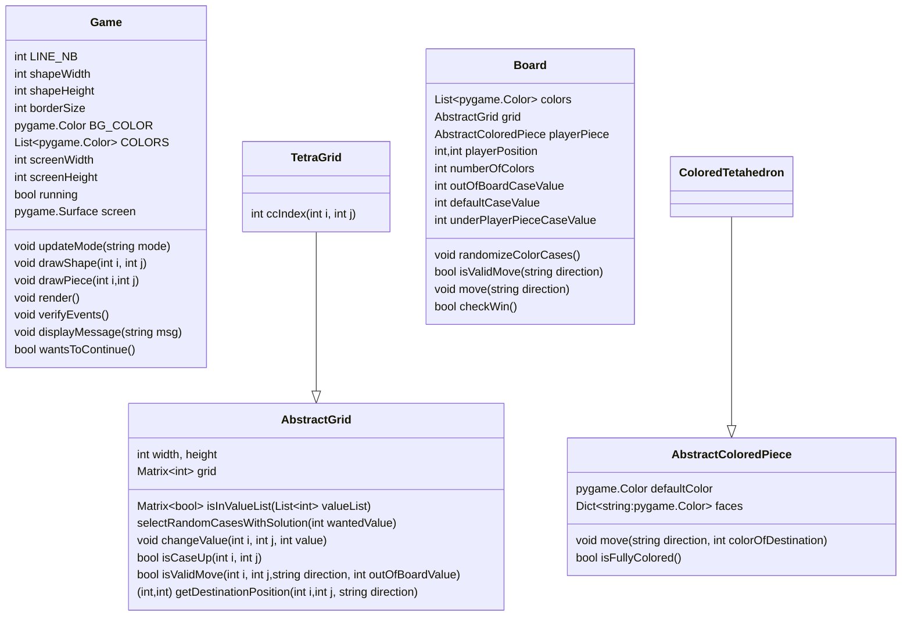

# tetahedronAI
AI playing Solo Tetahedron Game in Python

On a board of triangular tiles, the goal is to "roll" a pyramid with 4 faces (called a tetahedron). The pyramid moves by tilting from one face to another, always perfectly landing on a triangle.

# Class Diagram

# The Board
 

 

# The rules

- There will be 4 randomly placed colored triangles on the board.
- When an uncolored face of the pyramid is placed on a colored triangle on the board, the face of the pyramid takes on the color, and the triangle on the board loses its color.
- When a colored face of the pyramid is placed on an uncolored triangle on the board, the face of the pyramid loses its color, and the triangle on the board takes on the color.
- When a colored face of the pyramid is placed on a colored triangle on the board, no transfer of color is made.
- When an uncolored face of the pyramid is placed on an uncolored triangle on the board, no transfer of color is made.
- The game is won when all 4 faces of the tetrahedron are colored.

# Steps 

1. The board must have a hexagonal shape. 
2. The colors on the visible faces of the tetrahedron must be visible on the tetrahedron.
3. The placement logic of the colors must be respected (we do not display a color on the wrong side of the pyramid).
4. The pyramid cannot leave the board. 
5. Each game must necessarily have a solution.
6. The game must have the option to restart the game.
7. The game can be played with the keyboard keys.
8. In case of success, the game must notify it.
